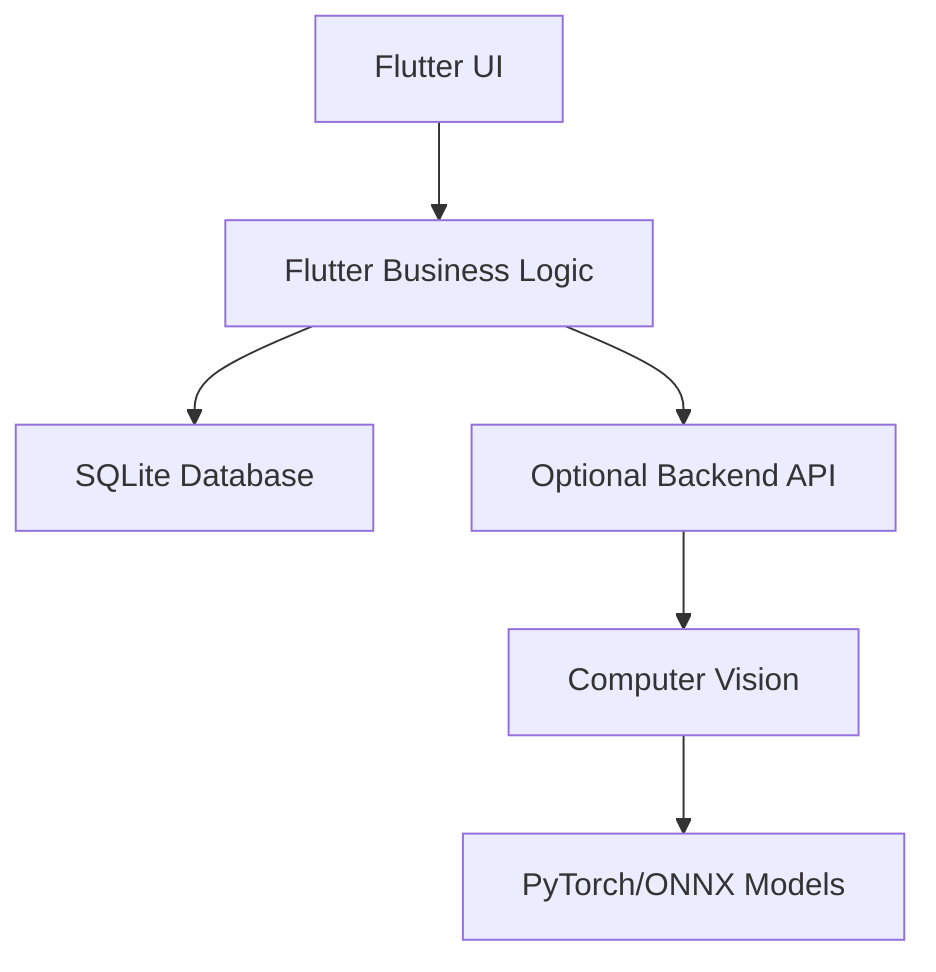

# Darts App Architecture

This document provides a detailed architectural overview aligned with the existing README.md specification.

## Global Architecture Overview



## Layered Architecture

### 1. Presentation Layer (Flutter UI)
- **Platform**: Android and iOS via Flutter
- **Responsibility**: User interface and interaction
- **Key Components**:
  - Game selection screens
  - Game play interfaces
  - Statistics dashboards
  - Game history views
  - Settings and configuration

### 2. Business Logic Layer (Flutter)
- **Responsibility**: Core application logic and game processing
- **Key Components**:
  - Game Engine (X01, Cricket, etc.)
  - Statistics Engine
  - Data Management
  - Backend Sync Manager (optional)
  - Game State Management

### 3. Data Layer (SQLite)
- **Responsibility**: Local data persistence
- **Implementation**: SQLite via `sqflite` and `path_provider` packages
- **Key Components**:
  - Database schema management
  - Data Access Objects (DAOs)
  - Query builders
  - Data validation
  - Backup/restore functionality

### 4. Optional Backend Layer
- **Responsibility**: Auto-scoring and sync (self-hosted)
- **Implementation**: REST API with computer vision
- **Options**: Python (Flask) or Rust
- **Key Components**:
  - REST API endpoints
  - Computer vision processing
  - Model inference (PyTorch/ONNX)
  - Data synchronization

## Flutter-Specific Architecture

### Package Structure

```
lib/
├── main.dart                    # App entry point
├── app/                        # App configuration
│   ├── routes.dart              # Navigation routes
│   └── theme.dart               # App theming
├── features/                   # Feature modules
│   ├── games/                  # Game features
│   │   ├── x01/                # X01 game module
│   │   ├── cricket/            # Cricket game module
│   │   └── shared/             # Shared game components
│   ├── statistics/             # Statistics features
│   ├── history/                # Game history
│   └── settings/               # App settings
├── data/                       # Data layer
│   ├── models/                 # Data models
│   ├── repositories/           # Data repositories
│   ├── datasources/            # Data sources
│   └── database/               # SQLite database
├── domain/                     # Business logic
│   ├── entities/               # Business entities
│   ├── repositories/           # Repository interfaces
│   ├── usecases/               # Use cases
│   └── services/               # Domain services
└── presentation/               # UI layer
    ├── widgets/                # Reusable widgets
    ├── screens/                # App screens
    └── components/             # UI components
```

### Key Flutter Components

#### Game Engine

```dart
abstract class Game {
  String get gameType;
  GameConfiguration get config;
  List<Player> get players;
  Player? get currentPlayer;
  GameState get currentState;
  
  void processDart(DartThrow dart);
  void undoLastThrow();
  void redoLastThrow();
  Player? determineWinner();
  Map<String, dynamic> serialize();
  void deserialize(Map<String, dynamic> data);
}

class X01Game extends Game {
  int _startingScore;
  InStrategy _inStrategy;
  OutStrategy _outStrategy;
  Map<String, int> _playerHandicaps;
  
  X01Game({required config, required players}) {
    // Initialize game with configuration
  }
  
  @override
  void processDart(DartThrow dart) {
    // X01-specific dart processing
    // Handle bust, checkout validation, etc.
  }
  
  bool _checkBust(int score) {
    // Bust logic
  }
  
  bool _validateCheckout(DartThrow dart) {
    // Checkout validation
  }
}

class CricketGame extends Game {
  CricketVariant _variant;
  Set<int> _numbersInPlay;
  Map<String, Set<int>> _closedNumbers;
  
  @override
  void processDart(DartThrow dart) {
    // Cricket-specific processing
    // Handle number closing and scoring
  }
  
  void _closeNumber(String playerId, int number) {
    // Close number logic
  }
}
```

#### Statistics Engine

```dart
class StatisticsEngine {
  final DatabaseHelper _db;
  
  StatisticsEngine(this._db);
  
  Future<PlayerStats> calculatePlayerStats(String playerId) async {
    // Compute statistics from raw dart data
    final darts = await _db.getPlayerDarts(playerId);
    
    return PlayerStats(
      totalGames: darts.length,
      averageScore: _calculateAverage(darts),
      highestCheckout: _findHighestCheckout(darts),
      // ... other computed stats
    );
  }
  
  Future<GameStats> calculateGameStats(String gameId) async {
    // Compute game-specific statistics
  }
  
  Future<List<TrendData>> getPerformanceTrends(String playerId) async {
    // Compute historical trends
  }
}
```

## Database Schema (SQLite)

### Core Tables

```sql
-- Players Table
CREATE TABLE players (
    player_id TEXT PRIMARY KEY, -- UUID
    name TEXT NOT NULL,
    created_at TEXT NOT NULL,   -- ISO 8601 timestamp
    last_active TEXT NOT NULL   -- ISO 8601 timestamp
);

-- Games Table
CREATE TABLE games (
    game_id TEXT PRIMARY KEY,   -- UUID
    game_type TEXT NOT NULL,    -- 'x01', 'cricket', etc.
    game_config TEXT NOT NULL,  -- JSON configuration
    start_time TEXT NOT NULL,   -- ISO 8601 timestamp
    end_time TEXT,              -- ISO 8601 timestamp (nullable)
    winner TEXT,                -- player_id or team_id (nullable)
    is_completed INTEGER DEFAULT 0,
    game_state TEXT             -- JSON state for resuming
);

-- Teams Table (for team games)
CREATE TABLE teams (
    team_id TEXT PRIMARY KEY,   -- UUID
    team_name TEXT NOT NULL,
    game_id TEXT NOT NULL,
    FOREIGN KEY (game_id) REFERENCES games(game_id)
);

-- Team Members Table
CREATE TABLE team_members (
    team_id TEXT NOT NULL,
    player_id TEXT NOT NULL,
    team_order INTEGER NOT NULL,
    PRIMARY KEY (team_id, player_id),
    FOREIGN KEY (team_id) REFERENCES teams(team_id),
    FOREIGN KEY (player_id) REFERENCES players(player_id)
);

-- Darts Table (core statistical data)
CREATE TABLE darts (
    dart_id INTEGER PRIMARY KEY AUTOINCREMENT,
    game_id TEXT NOT NULL,
    player_id TEXT NOT NULL,
    turn_number INTEGER NOT NULL,
    dart_number INTEGER NOT NULL, -- 1, 2, or 3
    score INTEGER NOT NULL,
    segment TEXT NOT NULL,       -- '20', 'T20', 'D16', 'SB', 'DB'
    x REAL,                      -- Optional coordinate
    y REAL,                      -- Optional coordinate
    FOREIGN KEY (game_id) REFERENCES games(game_id),
    FOREIGN KEY (player_id) REFERENCES players(player_id)
);

-- Game Participants Table
CREATE TABLE game_participants (
    game_id TEXT NOT NULL,
    participant_id TEXT NOT NULL, -- player_id or team_id
    participant_type TEXT NOT NULL, -- 'player' or 'team'
    PRIMARY KEY (game_id, participant_id),
    FOREIGN KEY (game_id) REFERENCES games(game_id)
);
```

## Data Access Layer

### Database Helper

```dart
class DatabaseHelper {
  static final DatabaseHelper _instance = DatabaseHelper._internal();
  factory DatabaseHelper() => _instance;
  
  static Database? _database;
  
  Future<Database> get database async {
    if (_database != null) return _database!;
    _database = await _initDatabase();
    return _database!;
  }
  
  Future<Database> _initDatabase() async {
    final docsDir = await getApplicationDocumentsDirectory();
    final path = join(docsDir.path, 'darts_app.db');
    
    return await openDatabase(
      path,
      version: 1,
      onCreate: _onCreate,
    );
  }
  
  Future<void> _onCreate(Database db, int version) async {
    // Create all tables
    await db.execute('''
      CREATE TABLE players (
        player_id TEXT PRIMARY KEY,
        name TEXT NOT NULL,
        created_at TEXT NOT NULL,
        last_active TEXT NOT NULL
      )
    ''');
    
    // Other table creation statements...
  }
  
  // Player CRUD operations
  Future<String> insertPlayer(Player player) async {
    final db = await database;
    await db.insert('players', player.toMap());
    return player.playerId;
  }
  
  Future<List<Player>> getAllPlayers() async {
    final db = await database;
    final maps = await db.query('players');
    return List.generate(maps.length, (i) => Player.fromMap(maps[i]));
  }
  
  // Game operations
  Future<String> insertGame(Game game) async {
    final db = await database;
    await db.insert('games', game.toMap());
    return game.gameId;
  }
  
  // Dart operations
  Future<int> insertDart(Dart dart) async {
    final db = await database;
    return await db.insert('darts', dart.toMap());
  }
  
  Future<List<Dart>> getGameDarts(String gameId) async {
    final db = await database;
    final maps = await db.query(
      'darts',
      where: 'game_id = ?',
      whereArgs: [gameId],
      orderBy: 'turn_number, dart_number'
    );
    return List.generate(maps.length, (i) => Dart.fromMap(maps[i]));
  }
}
```

## Backend Integration (Optional)

### Backend Service

```dart
class BackendService {
  final String baseUrl;
  final Dio _dio;
  
  BackendService({required this.baseUrl}) : _dio = Dio(BaseOptions(baseUrl: baseUrl));
  
  Future<Map<String, dynamic>> autoScoreImage(File image) async {
    try {
      final formData = FormData.fromMap({
        'image': await MultipartFile.fromFile(image.path),
      });
      
      final response = await _dio.post('/auto-score', data: formData);
      return response.data;
    } catch (e) {
      // Handle errors
      rethrow;
    }
  }
  
  Future<void> syncGameData(Game game) async {
    // Sync game data to backend
  }
  
  Future<List<DartDetection>> detectDarts(File image) async {
    // Call computer vision endpoint
  }
}
```

## State Management

### Game State Management

```dart
class GameProvider with ChangeNotifier {
  Game? _currentGame;
  List<DartThrow> _currentTurnDarts = [];
  bool _isGamePaused = false;
  
  Game? get currentGame => _currentGame;
  List<DartThrow> get currentTurnDarts => _currentTurnDarts;
  bool get isGamePaused => _isGamePaused;
  
  Future<void> startNewGame(GameConfiguration config, List<Player> players) async {
    _currentGame = GameFactory.createGame(config, players);
    _currentTurnDarts.clear();
    _isGamePaused = false;
    notifyListeners();
  }
  
  Future<void> loadGame(String gameId) async {
    final db = DatabaseHelper();
    final gameData = await db.getGame(gameId);
    _currentGame = GameFactory.deserializeGame(gameData);
    notifyListeners();
  }
  
  Future<void> processDart(DartThrow dart) async {
    if (_currentGame == null) return;
    
    _currentTurnDarts.add(dart);
    _currentGame!.processDart(dart);
    
    // Save to database
    final db = DatabaseHelper();
    await db.insertDart(dart);
    
    if (_currentTurnDarts.length >= 3 || dart.dartNumber == 3) {
      await _endTurn();
    }
    
    notifyListeners();
  }
  
  Future<void> _endTurn() async {
    // End turn logic
    _currentTurnDarts.clear();
    
    // Check for game completion
    final winner = _currentGame!.determineWinner();
    if (winner != null) {
      await _completeGame(winner);
    }
  }
  
  Future<void> _completeGame(Player winner) async {
    // Game completion logic
    _currentGame!.winner = winner;
    _currentGame!.isCompleted = true;
    
    // Update in database
    final db = DatabaseHelper();
    await db.updateGame(_currentGame!);
    
    // Update statistics
    final statsEngine = StatisticsEngine(db);
    await statsEngine.updatePlayerStats(winner.playerId);
    
    notifyListeners();
  }
}
```

## Key Architectural Decisions

### 1. Local-First with Optional Backend
- **Rationale**: Offline capability is essential for darts apps
- **Implementation**: SQLite for local storage, optional REST API sync
- **Benefits**: Works without internet, user privacy, no server costs

### 2. Flutter for Cross-Platform
- **Rationale**: Single codebase for Android and iOS
- **Implementation**: Flutter widgets with platform-specific adaptations
- **Benefits**: Faster development, consistent UI, hot reload

### 3. SQLite for Data Storage
- **Rationale**: Relational data, complex queries for statistics
- **Implementation**: sqflite package with proper schema
- **Benefits**: Better for statistics, long-term maintainability

### 4. Game Engine Pattern
- **Rationale**: Separate game logic from UI
- **Implementation**: Abstract Game class with concrete implementations
- **Benefits**: Easy to add new game types, consistent rules

### 5. Statistics Computation
- **Rationale**: Compute from raw data, not pre-calculated
- **Implementation**: StatisticsEngine with various algorithms
- **Benefits**: Flexible analysis, no data duplication

## Next Steps

1. **Implement Core Game Types**: X01, Cricket, Around the Clock
2. **Develop Database Layer**: Complete SQLite implementation
3. **Build UI Components**: Game boards, score displays, statistics views
4. **Implement Statistics Engine**: Compute various metrics from dart data
5. **Add Optional Backend**: Computer vision integration
6. **Testing**: Unit tests, integration tests, UI tests

## Questions for Architecture Review

1. Should we implement a game replay feature with animation?
2. What level of undo/redo functionality is needed for dart throws?
3. Should we support real-time multiplayer (local network) in addition to hotseat?
4. What authentication method should we use for backend sync (if any)?
5. Should we implement data migration strategies for future schema changes?