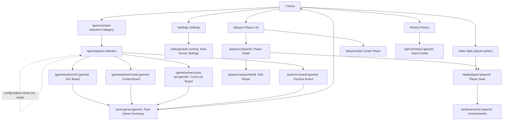

# UI Screen Flow Specifications

**Status:** Authoritative
**Version:** 5.0.0
**Companion specs:**
- `docs/design/SCREEN_SPECS.md` — detailed per-screen layout, typography, color, and notes
- `docs/design/DESIGN_SYSTEM.md` — design tokens (color, typography, spacing, radius)

All token names referenced in this document (e.g. `colorPrimary`, `textHeadingMedium`) are defined in `DESIGN_SYSTEM.md`. All per-screen detail lives in `SCREEN_SPECS.md`. This document covers navigation structure, screen index, and flow overview.

---

## Navigation Structure

The app uses a **hub-and-spoke** pattern.

- **Home** is the single hub. All other screens are spokes reachable from Home.
- There is **no persistent bottom navigation bar** anywhere in the app.
- **Settings** is accessed via a gear icon (⚙) in the Home AppBar only.
- Every sub-screen has only a back button in its AppBar — no other persistent nav chrome.
- **Game boards** (X01, Cricket, Count Up, Practice) are full-screen with no AppBar navigation chrome.
- Sub-screen state does not need to be preserved between visits — reload-on-entry is acceptable.
- No `StatefulShellRoute` / persistent navigation stack is needed.

### Navigation Semantics (`context.push` vs `context.go`)

`go_router` is wired in `lib/app/app_router.dart`. The intent rule:

- **`context.push`** — back-poppable forward navigation. Used for every Home → spoke jump (Statistics, History, Players, Settings), list → detail, and Settings → Auto-Scorer Settings. The Android/OS back button pops back to the previous screen.
- **`context.go`** — intentional stack resets that must NOT be back-poppable: game start → board, board/post-game → Home, and post-deletion / erase-all-data redirects.
- **`PopScope(canPop: false)`** wraps screens reached via `go()` that still need a working hardware back button (e.g. Variant Selection redirects back to Home on pop).
- **`GoRoute.onExit`** guards the active boards (X01 / Cricket / Practice). It runs for in-app `context.go`, browser back/forward, and OS gesture — showing a confirm-before-leave dialog so an in-progress game can't be silently abandoned (#319). It short-circuits (no dialog) when the game is already complete in the DB. Count Up has no `onExit` guard.

---

## Navigation Flow



---

## Screen Index

| # | Screen | Route |
|---|--------|-------|
| 1 | Home | `/` |
| 2 | Variant Selection | `/game/variant-selection/:category` |
| 3 | Player Selection | `/game/player-selection` |
| 4 | Game Config (modal bottom sheet — no route) | — |
| 5 | X01 Board | `/game/active/x01/:gameId` |
| 6 | Cricket Board | `/game/active/cricket/:gameId` |
| 6b | Count Up Board | `/game/active/count-up/:gameId` |
| 7 | Practice Board | `/practice-board/:gameId` |
| 7a | — Around the Clock | (subtype of 7) |
| 7b | — Bob's 27 | (subtype of 7) |
| 7c | — Catch-40 | (subtype of 7) |
| 7d | — Shanghai | (subtype of 7) |
| 7e | — Checkout Practice | (subtype of 7) |
| 8 | Player List | `/players` |
| 9 | Player Detail | `/players/:playerId` |
| 10 | Create Player | `/players/add` |
| 11 | Edit Player | `/players/:playerId/edit` |
| 12 | Stats Root (player picker) | `/stats` |
| 14 | Player Statistics | `/stats/player/:playerId` |
| 14a | Achievements | `/achievements/:playerId` |
| 15 | Post-Game Summary | `/post-game/:gameId` |
| 16 | History | `/history` |
| 17 | Game Detail | `/game/history/:gameId` |
| 18 | Settings | `/settings` |
| 19 | Auto-Scorer Settings | `/settings/auto-scoring` |

> Number 13 is intentionally absent — a Leaderboard route is reserved for a future screen and is not yet implemented.

---

## Per-Screen Summaries

For full layout details, typography, and color usage see `docs/design/SCREEN_SPECS.md`.

### 1. Home (`/`)

```
┌─────────────────────────────┐
│  DartLodge               ⚙ │  ← gear → Settings (AppHeader trailing)
├─────────────────────────────┤
│  [⊕ X01      301, 501, 701  →] │  ← vertical list of kinetic game cards
│  [⊕ CRICKET  Strategic Play →] │    (80dp tall, full-width)
│  [⊕ CASUAL   Shanghai, …    →] │
│  [⊕ PRACTICE Improve Skills →] │
│                             │
│  📊 STATISTICS  Analyze Data  │  ← flat nav rows (no card chrome)
│  🕘 HISTORY     Sessions      │
│  👥 PLAYERS     Roster        │
└─────────────────────────────┘
```

- A single vertically-scrolling `Column` (`SingleChildScrollView`). There is **no** 2×2 grid and **no** "coming soon" block.
- **Four kinetic game cards**, in order: X01 (→ `variant-selection/x01`), Cricket (→ `.../cricket`), Casual (→ `.../casual`), Practice (→ `.../practice`). Each is 80dp tall, full-width, with a leading icon chip in `primaryContainer`, an ALL-CAPS label, a subtitle, and a trailing chevron. Tapping resets `gameSetupProvider` then `context.push`es the matching Variant Selection.
- **Three flat nav rows** below the cards: Statistics (→ `/stats`), History (→ `/history`), Players (→ `/players`). These are plain `InkWell` rows (icon + ALL-CAPS label + right-aligned descriptor), NOT game cards — Statistics is a nav row, not a game card.
- Gear icon (⚙) is the `AppHeader` trailing action and is the **only** entry point to Settings.

---

### 2. Variant Selection (`/game/variant-selection/:category`)

```
┌─────────────────────────────┐
│  AppBar: "[Category]"       │
├─────────────────────────────┤
│  [501 — Double Out]         │  ← tappable variant tiles
│  [301 — Double Out]         │    minimum 64dp height
│  [Standard Cricket]         │    single tap → Player Selection
│  …                          │
└─────────────────────────────┘
```

- The path parameter is **`:category`**, not a game type. Valid values: `x01`, `cricket`, `casual`, `practice` (one per Home game card).
  - `x01` — 301 / 501 / 701 variants.
  - `cricket` — standard / cut-throat / no-score × fixed / random / crazy target modes.
  - **`casual`** — Shanghai and Count-Up.
  - `practice` — Around the Clock, Bob's 27, Catch-40, Checkout Practice.
- A single tap pre-selects the variant and navigates directly to Player Selection — no confirm button.
- Reached via `context.go` from Home; the page wraps its body in `PopScope(canPop: false)` so the hardware back button redirects to Home instead of doing nothing.
- Selected tile: `colorPrimaryContainer` background, 3dp `colorPrimary` left border.

---

### 3. Player Selection (`/game/player-selection`)

```
┌─────────────────────────────┐
│  AppBar: "Players"          │
├─────────────────────────────┤
│  [501 · Double Out · Best of 3  ▾]  ← config chip, full-width, tappable
├─────────────────────────────┤
│  Selected players (drag to reorder) │
│  [Avatar] [Avatar] …        │
│   NAME     NAME             │
├─────────────────────────────┤
│  ┌─────────────────────┐    │
│  │ [Av][Av][Av][Av]    │    │  ← 4-col roster grid
│  │ NAME NAME NAME NAME │    │    ~2.33 rows visible (scroll cue)
│  │ [Av][Av][Av][ + ]   │    │
│  └─────────────────────┘    │
├─────────────────────────────┤
│  [START GAME]               │  ← full-width, SafeArea, 38% opacity when empty
└─────────────────────────────┘
```

- Config chip taps open the Game Config bottom sheet (Screen 4). The ⚙ icon is **not** present here.
- Roster "+" cell opens an inline modal: avatar preview + name field + CREATE PLAYER. New player auto-selected.
- Turn order matters — drag to reorder selected players.

---

### 4. Game Config — Modal Bottom Sheet (no route)

> Game Config is **not** a routed screen. It is a `showModalBottomSheet<GameConfig>` opened from the config-summary chip on Player Selection (`player_selection_page.dart`). There is no `/game/config` URL.

```
┌─────────────────────────────┐
│  ──── drag handle           │
│  "Game Settings"            │
│                             │
│  Starting Score: [501▾]     │
│  In Strategy:   [Any ▾]     │
│  Out Strategy:  [Double▾]   │
│  Legs to Win:   [− 3 +]     │
│                             │
│  [APPLY SETTINGS]           │
└─────────────────────────────┘
```

- Rendered as a modal bottom sheet (`maxChildSize: 0.75`).
- Changes are local until APPLY SETTINGS is tapped. Drag-dismiss cancels without saving.

---

### 5. X01 Board (`/game/active/x01/:gameId`)

Full-screen, no AppBar nav chrome. `GoRoute.onExit` shows a confirm-before-leave dialog for any in-progress exit (#319).

```
AppBar: "501" / "Leg 1 of 3"                          [⋮]
Dart indicator: [60] [T20] [○] [○]
──────────────────────────────────────────────
| [60]312 | 501    | …  |   ← N equal-width player columns
| ALICE ▶ | BOB    |    |     score + name + PPR
──────────────────────────────────────────────
💡 T20 · T18 · D8           ← checkout banner (≤170 only)
──────────────────────────────────────────────
Segment input grid:
  [ MISS ]  [ 25 ]  [ 50 ]           ← row 0 (miss / SB / DB)
  [ 20 ][ 19 ]…[ 12 ][ 11 ]         ← rows 1–2 (singles 20→1)
  [ 20 ][ 19 ]…[ 12 ][ 11 ]         ← rows 3–4 (doubles ·· )
  [ 20 ][ 19 ]…[ 12 ][ 11 ]         ← rows 5–6 (triples ···)
──────────────────────────────────────────────
[↩ Undo]                    [NEXT ROUND]
```

- Segment grid is grouped by **multiplier** (not by number): singles / doubles / triples, each spanning 2 rows of 10.
- Dots below numbers are purely visual: 2 filled dots = double, 3 filled dots = triple; no text label.
- Checkout banner collapses to zero height when not relevant.
- Active player column: `colorActivePlayerBg` background, 4dp `colorActivePlayer` left border.
- Singles: `colorSurface`; doubles: `colorPrimaryContainer`; triples: `colorPrimary` background.

**Camera-first variant.** When auto-scoring is on and a camera preview is available (`cameraFirst = autoScoringOn && cameraPreview != null`, #477), the board switches to an alternate at-distance-readable layout: a `HeroMetricWidget` for the active player's score, an `X01OtherPlayersStripWidget` for opponents, and a `ProminentDartBandWidget` carrying the dart indicator (the status bar hides its darts). The manual segment grid above is the `else` layout.

---

### 6. Cricket Board (`/game/active/cricket/:gameId`)

Full-screen, no AppBar nav chrome. `GoRoute.onExit` confirm-before-leave (#319). Unified table — scoreboard columns and input button columns share the same rows.

```
AppBar: "Cricket | Standard · Leg 1"                [⋮]
Dart indicator: [T20] [○] [○]
──────────────────────────────────────────────────────
| 64      | 32      | [MISS]  | [UNDO]  |  ← header row
| ALICE   | BOB     |         |         |
──────────────────────────────────────────────────────
| ⊗       | X       | [ 20 ] | [ 20 ] | [ 20 ] |
| /       | ⊗       | [ 19 ] | [ 19 ] | [ 19 ] |
| X       | X       | [ 18 ] | [ 18 ] | [ 18 ] |
| ─       | /       | [ 17 ] | [ 17 ] | [ 17 ] |
| ─       | ─       | [ 16 ] | [ 16 ] | [ 16 ] |
| ─       | ─       | [ 15 ] | [ 15 ] | [ 15 ] |
| ─       | ─       | [Bull] | [Bull] | (gap)  |  ← no triple for Bull
──────────────────────────────────────────────────────
|                              | [NEXT PLAYER]      |
```

Mark symbols: `─` (0 marks) → `/` (1) → `X` (2) → `⊗` (3+, `colorCricketClosed`).
Closed rows (all players ≥3 marks) are dimmed to 38% opacity; input buttons disabled.
Input button styling mirrors X01: single = `colorSurface`, double = `colorPrimaryContainer`, triple = `colorPrimary`.

**Camera-first variant.** Like X01, when `cameraFirst` is active the board uses the at-distance layout (#477): `HeroMetricWidget` for the active player's marks/score, a `CricketMarksStripWidget` for the per-target mark state, and `ProminentDartBandWidget` for the darts.

---

### 6b. Count Up Board (`/game/active/count-up/:gameId`)

Full-screen, no AppBar nav chrome. The casual "Count Up" game (score-accumulation, fixed rounds). Unlike X01/Cricket/Practice, this board has **no** `GoRoute.onExit` confirm guard. Completion routes to Post-Game Summary.

---

### 7. Practice Board (`/practice-board/:gameId`)

Full-screen, no AppBar nav chrome. `GoRoute.onExit` confirm-before-leave (#319). Five sub-types share a common chrome:

```
AppBar: "[Game Name]" / "[progress subtitle]"        [⋮]
Dart indicator: [60] [T20] [○] [○]
────────────────────────────────────────────────────
  DartboardHighlightWidget (Expanded)
  current target highlighted colorPrimary; others 35% opacity
────────────────────────────────────────────────────
  Target label (48sp Oswald, colorPrimary)
  Secondary metric (textBodyMedium, colorOnSurfaceVariant)
────────────────────────────────────────────────────
  Input buttons (varies per sub-type — see below)
────────────────────────────────────────────────────
  [↩ Undo]  [MISS]  [ACTION]
```

**7a. Around the Clock** — subtitle "Number: N / 20". Input: `[S-N] [D-N] [T-N]`. Action: `NEXT ROUND` (enabled when `dartsThrownInTurn == 3`). Ends when target advances past 20.

**7b. Bob's 27** — subtitle "Target: D{N}". Score starts at 27; can go negative. Input: `[S-N] [D-N] [T-N]` (S and T dimmed, still tappable). Action: `NEXT ROUND`. Ends early if score ≤ 0 after any round.

**7c. Catch-40** — subtitle "Round N / {total}". Target threshold ≥40 per round. Input: full X01-style segment grid (MISS + singles + doubles + triples). Action: `NEXT ROUND`.

**7d. Shanghai** — subtitle "Round N / {total}". Input: `[S-N] [D-N] [T-N]`. Shanghai bonus if all three hit in one turn. Action: `NEXT ROUND`.

**7e. Checkout Practice** — subtitle "{successes}/{attempts} checkouts". Input: full X01-style segment grid. Action: `END DRILL` (always enabled after 3 darts). No `MISS` button in bottom bar (use grid row 0). Turn advances automatically after 3 darts.

**Camera-first variant.** When `cameraFirst` is active (#477), the practice board uses the at-distance layout: `PracticeTargetDisplayWidget(heroSize: true)` for the current target, a `PracticePlayersStripWidget`, and `ProminentDartBandWidget` for the darts.

---

### 8. Player List (`/players`)

```
┌─────────────────────────────┐
│  AppBar: "Players"  [+]    │
├─────────────────────────────┤
│  [Avatar] ALICE             │
│           3-dart avg 54.3   │
│  [Avatar] BOB               │
│           3-dart avg 41.0   │
│  …                          │
└─────────────────────────────┘
```

- Minimum row height 64dp. Tap row → Player Detail.
- Empty state: icon + "No players yet. Tap + to add your first player."

---

### 9. Player Detail (`/players/:playerId`)

```
┌─────────────────────────────┐
│  AppBar: "ALICE"    [✏] [🗑] │
├─────────────────────────────┤
│  [Avatar 96dp]              │
│   ALICE                     │
│   Member since … · Last active … │
├─────────────────────────────┤
│  Career Statistics [VIEW STATISTICS] │
└─────────────────────────────┘
```

- AppBar actions: **edit** (✏) → `context.push` Edit Player (Screen 11, passing the current name via `extra`); **delete** (🗑) → confirmation dialog with `colorError` destructive confirm → on confirm, `context.go` back to Player List.
- Shows avatar, name, "Member since" and "Last active" dates.
- "VIEW STATISTICS" `context.push`es Player Statistics (Screen 14).

---

### 10. Create Player (`/players/add`)

```
┌─────────────────────────────┐
│  AppBar: "New Player"       │
├─────────────────────────────┤
│  Avatar preview (60dp)      │
│  [      Name field      ]   │
│  [CREATE PLAYER]            │
└─────────────────────────────┘
```

- Button disabled until name is non-empty and unique. Max 24 chars; counter shown at 80% limit.
- Avatar initials update live as user types.

---

### 11. Edit Player (`/players/:playerId/edit`)

Edits an existing player's name. Reached from Player Detail (the name is the editable field; the route receives the current name via `extra`). Save validation mirrors Create Player (non-empty, unique). Back returns to Player Detail.

---

### 12. Stats Root (`/stats`) — Player Picker

`StatsTabPage`. Reached from the Home **Statistics** nav row. Presents a player picker; selecting a player pushes their Player Statistics (Screen 14). (No longer "deferred".)

---

### 14. Player Statistics (`/stats/player/:playerId`)

```
┌─────────────────────────────┐
│  [←]                     🏆 │  ← AppHeader: back + trophy → Achievements
│  ALICE                      │
├─────────────────────────────┤
│  [X01] [Cricket] [Practice] [Others] │  ← 4 game-type tabs
├─────────────────────────────┤
│  [Legs Played] [Legs Won] [Solo Games]  ← 3 summary cards
├─────────────────────────────┤
│  [All X01▾][501][301] …    │  ← variant chip selector (X01 tab only)
├─────────────────────────────┤
│  [Last 10] [Last 100] [All] │  ← time range segmented button
├─────────────────────────────┤
│  PPR trend (line chart)     │
├─────────────────────────────┤
│  Detail table               │
│  PPR | First9 PPR | CO% | … │
├─────────────────────────────┤
│  Impact heatmap (all-time)  │  ← StatsHeatmapSectionWidget
└─────────────────────────────┘
```

- **Four tabs:** X01, Cricket, Practice, Others. X01 / Cricket / Practice each render full stats (summary cards, selectors, trend chart, detail table) — they are NOT "coming soon". Only the **Others** tab is a coming-soon placeholder. (The Cricket tab adds a target-mode + variant chip selector; the Practice tab adds a game-type chip selector and an annotated dartboard for Around the Clock.)
- **Achievements trophy** (🏆) in the AppHeader trailing action → `/achievements/:playerId` (Screen 14a).
- **All-time impact heatmap** (`StatsHeatmapSectionWidget`) at the bottom of the X01 / Cricket / Practice tabs — see "Heatmap surfaces" below. It is **aggregated all-time per gameType** and explicitly **ignores** the Last 10 / Last 100 / All time-range selector. Auto-hidden when the player has no located darts for that gameType.
- Reached from the Home Statistics row (via the `/stats` player picker) or "VIEW STATISTICS" on Player Detail.

---

### 14a. Achievements (`/achievements/:playerId`)

`AchievementsPage`. Reached from the trophy action in the Player Statistics AppHeader. Lists the player's unlocked / locked achievements (epic #521). Back returns to Player Statistics.

---

### 15. Post-Game Summary (`/post-game/:gameId`)

```
┌─────────────────────────────┐
│  AppBar: "Game Summary"     │  ← no back button
├─────────────────────────────┤
│  🏆 ALICE  WINNER            │  ← winner card (colorWinContainer bg)
│   Avg: 72.3  Darts: 43      │
│  BOB                        │  ← loser card (colorSurface)
│   Avg: 54.1  Darts: –       │
├─────────────────────────────┤
│  Impact heatmap             │  ← GameHeatmapSectionWidget
│  [ALICE ▾]  ●●● on board    │    (per-player selector if multi-competitor)
├─────────────────────────────┤
│  [PLAY AGAIN]  [DONE]       │
└─────────────────────────────┘
```

- No back button (`automaticallyImplyLeading: false`). Navigation is explicit via the two buttons.
- Winner card: animated checkmark entrance (300ms scale-in) on first appear.
- **Per-game impact heatmap** (`GameHeatmapSectionWidget`): renders detected dart impacts for the game on a mock dartboard. A per-player selector chooses which competitor's impacts to show (multi-competitor games). The whole section is **auto-hidden** when the game has no located darts (e.g. a fully-manual game).

---

### 16. History (`/history`)

```
┌─────────────────────────────┐
│  AppBar: "History"          │
├─────────────────────────────┤
│  [All▾] [Date range▾] [✕]  │  ← filter bar
├─────────────────────────────┤
│  X01 · 501                  │
│  ALICE won · 3 legs         │
│  Mar 8 · 43 darts           │
│  …                          │
└─────────────────────────────┘
```

- Reached from Home History card. Infinite scroll; `loadNextPage()` fires within 200px of bottom.
- Initial load: 3 shimmer skeleton cards. Empty state: icon + "No completed games yet."

---

### 17. Game Detail (`/game/history/:gameId`)

```
┌─────────────────────────────┐
│  AppBar: "X01 · 501"  [←]  │
├─────────────────────────────┤
│  ALICE won · 43 darts       │
│  Mar 8, 2026                │
├─────────────────────────────┤
│  Per-player stat cards      │
│  [Avg] [High checkout]      │
│  [Legs] [Darts thrown]      │
├─────────────────────────────┤
│  Leg breakdown table        │
│  Leg 1: ALICE 25 darts      │
│  Leg 2: BOB   31 darts      │
│  …                          │
└─────────────────────────────┘
```

---

### 18. Settings (`/settings`)

```
┌─────────────────────────────┐
│  AppBar: "Settings"  [←]   │
├─────────────────────────────┤
│  THEME                      │
│   [Light | System | Dark]   │  ← 3-way SegmentedButton
│  LANGUAGE                   │
│   [Language selector]       │
│  SOUND                      │
│   [Sound effects]  toggle   │
│  AUTO-SCORING               │
│   [Camera auto-scoring  →]  │  → Auto-Scorer Settings
│  ABOUT                      │
│   [Version]                 │
│   [Open Source Licenses]    │
│  FEEDBACK                   │
│   [Report a Bug]            │  → Sentry feedback dialog
│  DEBUG                      │
│   [Download database]       │
│  DANGER ZONE                │
│   [Erase all data]          │  ← destructive (colorError)
└─────────────────────────────┘
```

- Accessed via ⚙ in Home AppHeader only. Back returns to Home (`context.pop`, falling back to `context.go(home)`).
- **Theme** — a 3-way `SegmentedButton` (Light / System / Dark). Not a Dark-Mode toggle.
- **Language** — locale selector (`null` = system locale); part of the i18n epic.
- **Sound effects** — `SwitchListTile` toggling the sound-effects opt-in.
- **Auto-Scoring** — a `ListTile` that `context.push`es Auto-Scorer Settings (Screen 19).
- **About** — Version (read from `appVersionProvider`) + "Open Source Licenses" → Flutter's built-in `LicensePage`.
- **Feedback** — "Report a Bug" opens a text dialog and submits via `Sentry.captureFeedback`.
- **Debug** — "Download database" exports the Drift DB (shows inline progress).
- **Danger Zone** — "Erase all data" (destructive, `colorError`); confirms, clears all data, then `context.go(home)`.

---

### 19. Auto-Scorer Settings (`/settings/auto-scoring`)

`AutoScorerSettingsPage` (in the `auto_scorer` feature). Reached from the Auto-Scoring `ListTile` in Settings. Controls:

- **Use auto-scoring** — master opt-in for camera detection during games.
- **Auto-advance when board is cleared** — opt-in to auto-advance the turn on a confirmed board-clear.
- **Record sessions (debug)** — log the camera detection stream for off-device replay; "Export latest recording" shares the most recent session bundle.
- **Setup tips** — review-only re-read of the camera setup tips.
- **Collect training data** — opt-in to store board photos + corrections; "What to capture" is a `SegmentedButton` (All / Mistakes only); "Export training data" shares a zip of captured frames (with a clear-after-export prompt).
- **Detection thresholds** — two confidence sliders (Calibration confidence, Dart confidence), 0.05–0.90.

---

## Cross-Screen Patterns

### Heatmap surfaces (#571)

Dart-impact heatmaps render located dart positions on a mock dartboard. There are two surfaces, both **auto-hidden when there are no located darts** (e.g. a fully-manual game has no impact positions):

| Surface | Widget | Scope |
|---|---|---|
| Post-Game Summary (Screen 15) | `GameHeatmapSectionWidget` | This game only; per-player selector for multi-competitor games. |
| Player Statistics (Screen 14) | `StatsHeatmapSectionWidget` | All-time, aggregated per gameType tab (X01 / Cricket / Practice). **Ignores** the Last 10 / Last 100 / All time-range selector. |

### Loading States

| Context | Pattern |
|---|---|
| Full page initial load | Centered `CircularProgressIndicator` in `colorPrimary` on `colorBackground` |
| List initial load | 3 shimmer skeleton cards in `colorSurfaceVariant`, `radiusMedium` |
| List pagination | Small `CircularProgressIndicator` centered below last item |
| Button async action | `SizedBox(20×20)` `CircularProgressIndicator(strokeWidth: 2)` replaces button text |

### Error States

| Context | Pattern |
|---|---|
| Full page error | Centered `error_outline` icon (48dp) + message + "Retry" `TextButton` in `colorPrimary` |
| Snackbar (transient) | `colorErrorContainer` background, `colorOnErrorContainer` text, auto-dismiss 4s |
| Validation error (inline) | Field border `colorError`; helper text below in `colorError`, `textBodySmall` |

### Empty States

All empty states:
- Centered layout
- Large icon (64dp) in `colorOnSurfaceVariant` at 60% opacity
- Primary message: `textBodyLarge`, `colorOnBackground`
- Secondary message / CTA: `textBodyMedium`, `colorOnSurfaceVariant`
- When a creation CTA exists: `FilledButton` in `colorPrimary`

### Dialogs

All confirmation dialogs:
- Title: `textHeadingSmall`
- Body: `textBodyMedium`
- Cancel: `TextButton`, `colorOnBackground`
- Confirm: `FilledButton`, `colorPrimary` for neutral actions; `colorError` filled for destructive actions
- Corner radius: `radiusMedium` (12dp)
- Minimum width: `min(screen_width − 48dp, 320dp)`
